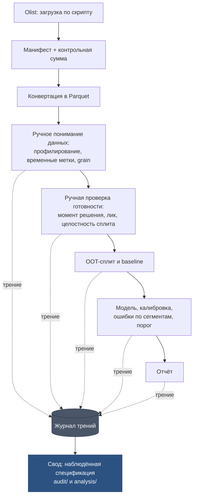

# feat: Repo scaffold and Stage 0 manual pass on Olist

## Summary

Развернуть репозиторий личного DS-инструментария с настоящей границей между ядром и проектами-экземплярами, затем пройти на Olist полный путь от загрузки данных до модели и отчёта **вручную**, фиксируя каждое трение. Выход этапа — не библиотека, а журнал трений, свёрнутый в наблюдённую спецификацию для будущих `audit/` и `analysis/`.

## Problem Frame

Концепция (`CONCEPT_V2.md`) описывает инструмент, требования к которому пока угаданы: автор не ведёт DS-проектов и не имеет рабочего сценария. Три архитектурных ревью сошлись на том, что спецификация, выведенная из нуля примеров, неотличима от захардкоженной под воображаемый случай.

Этап 0 закрывает этот разрыв самым дешёвым способом: один реальный проход по публичному датасету даёт список того, что действительно раздражает, — и он становится спецификацией вместо догадок. Репозиторий разворачивается до прохода, чтобы упражнение сразу легло в структуру, соблюдающую десять необратимых решений, а не в разрозненные файлы.

---

## Requirements

### Packaging and boundaries

R1. Ядро устанавливается как пакет (`uv pip install -e .`) и импортируется проектами как библиотека.
R2. Ядро не импортирует ничего из `projects/`; нарушение ловится линтером в CI-проверке, а не дисциплиной.
R3. Рабочие проекты работодателей в этом репозитории не хранятся — `projects/` содержит только учебные и публичные экземпляры.
R4. Данные не коммитятся: в репозитории лежит манифест источника с контрольной суммой и скрипт загрузки.

### Stage 0 protocol

R5. Полный проход по Olist воспроизводится из пронумерованных скриптов, а не из ноутбука.
R6. Каждое трение фиксируется в журнале в структурированном виде в момент возникновения, а не восстанавливается по памяти в конце.
R7. Журнал с первого дня разделён на переносимую часть (обобщённые уроки) и непереносимую (конкретика места).
R8. Ядро на этапе 0 не пишется. Единственное исключение — инфраструктура получения данных (R4), не являющаяся предметом наблюдения.

### Reproducibility invariants

R9. Артефакты прогона неизменяемы и адресуются по хэшу содержимого; `latest` — только алиас.
R10. Повторный прогон тех же скриптов на тех же входах даёт совпадающие хэши артефактов.

---

## Key Technical Decisions

KTD1. **Один репозиторий с границей пакета, а не два репозитория.** Ядро в `src/dsx/` ставится как пакет, проекты импортируют его. Граница получается настоящая (обратная зависимость запрещена линтером), а синхронизация версий двух репозиториев соло-разработчиком не оплачивается. Разделение потом дёшево, если границы соблюдались; обратное слияние дороже.

KTD2. **Обобщение на этапе 0 запрещено; вместо выноса в модуль — запись в журнал.** Абстракция, выведенная из одного примера, воспроизводит ту же угаданную спецификацию, ради устранения которой этап и затевается. Правило операциональное: потянуло вынести — это сигнал записать трение, а не рефакторить.

KTD3. **Контракты — YAML со схемами pydantic; формулы метрик — SQL-фрагменты, валидируемые DuckDB при загрузке.** Собственный DSL нарушает необратимое решение 5 (расширения — данные, не код) в первый же день. Заимствование SQL как языка выражений даёт бесплатную проверку синтаксиса вместо собственного парсера.

KTD4. **Скрипты, а не ноутбуки, для всего, что производит артефакт.** Ноутбук не удовлетворяет R10 и не даёт lineage. Ноутбуки остаются инструментом разведки, но их выводы переносятся в скрипт прежде, чем стать частью прохода.

KTD5. **Учебные проекты внутри репозитория, рабочие — снаружи.** Рабочий конфиг содержит имена таблиц работодателя. Правило вводится до первой работы, потому что нарушается оно однократно и необратимо.

KTD6. **Git инициализируется первым действием, данные в `.gitignore` с самого начала.** Датасет Olist под лицензией CC BY-NC-SA не подлежит перераспределению, а привычка не коммитить данные понадобится на работе тем более.

---

## High-Level Technical Design

Поток этапа 0 и точки порождения записей журнала:



Журнал — не побочный продукт, а основной выход этапа. Пайплайн существует для того, чтобы его породить.

---

## Output Structure

```
adaptive-ds/
  pyproject.toml               ядро как устанавливаемый пакет
  .gitignore                   данные, артефакты, mlruns
  README.md
  src/dsx/
    __init__.py
    contracts/                 pydantic-схемы (заготовка, наполняется позже)
    io/
      manifest.py              манифест источника, контрольные суммы
      acquire.py               загрузка и конвертация
  projects/
    olist-delivery-delay/
      config.yaml              контракт проекта-экземпляра
      steps/                   пронумерованные скрипты ручного прохода
      artifacts/               .gitignore
      report/
  knowledge/
    portable/                  переносимые уроки
    local/                     .gitignore, конкретика места
  docs/
    plans/
  tests/
```

Дерево — заявление о форме, а не ограничение. `**Files**` в единицах остаются авторитетными.

---

## Implementation Units

### U1. Repo scaffold and package boundary

**Goal.** Репозиторий с устанавливаемым ядром, границей импорта и правилами игнорирования, соблюдающими необратимые решения.

**Requirements.** R1, R2, R3, R9.

**Dependencies.** Нет.

**Files.**
- `pyproject.toml`
- `.gitignore`
- `README.md`
- `src/dsx/__init__.py`
- `src/dsx/contracts/__init__.py`
- `tests/test_import_boundary.py`

**Approach.** `git init` первым действием. Пакет `dsx` в layout `src/`, ставится редактируемым через uv. Запрет обратной зависимости выражается правилом import-linter (`dsx` не может импортировать `projects`) и проверяется тестом, а не соглашением. В `.gitignore` сразу: данные, артефакты, `mlruns/`, `knowledge/local/`. README фиксирует правило KTD5 текстом, чтобы оно было видно при клонировании на рабочей машине.

**Patterns to follow.** Стандартный src-layout Python; конфигурация инструментов в `pyproject.toml` без отдельных ini-файлов.

**Test scenarios.**
- Импорт `dsx` из чистого окружения после установки проходит.
- Правило границы: модуль внутри `dsx`, импортирующий `projects.*`, вызывает падение проверки. Тест конструирует нарушение и ожидает ошибку.
- `.gitignore` покрывает `projects/*/artifacts/` и `knowledge/local/`: файл, созданный по этим путям, не попадает в `git status --porcelain`.

**Verification.** Свежий клон + установка + прогон тестов проходит без ручных шагов.

---

### U2. Dataset acquisition and source manifest

**Goal.** Воспроизводимое получение Olist с фиксацией происхождения и контрольных сумм, без попадания данных в git.

**Requirements.** R4, R8, R9, R10.

**Dependencies.** U1.

**Files.**
- `src/dsx/io/manifest.py`
- `src/dsx/io/acquire.py`
- `projects/olist-delivery-delay/manifest.yaml`
- `tests/test_manifest.py`

**Approach.** Единственное место, где на этапе 0 пишется аккуратный код: получение данных не является предметом наблюдения, переписывать его потом незачем. Загрузка идёт через Kaggle API и требует токена в `~/.kaggle/kaggle.json`; отсутствие токена даёт понятную ошибку с указанием, что получить и куда положить. Манифест хранит источник, дату получения, лицензию, перечень файлов и SHA-256 каждого. Конвертация CSV в Parquet выполняется один раз, результат тоже попадает в манифест. Несовпадение контрольной суммы — жёсткая ошибка, а не предупреждение: это первый носитель принципа воспроизводимости.

**Test scenarios.**
- Манифест, собранный по каталогу, содержит по записи на файл с непустым SHA-256.
- Изменение байта в файле приводит к ошибке проверки с указанием конкретного файла.
- Повторный запуск получения при уже совпадающих суммах не перекачивает данные и не меняет манифест.
- Отсутствующий файл из манифеста даёт отличимую ошибку от изменённого.
- Конвертация в Parquet идемпотентна: повторный прогон даёт файл с тем же хэшем.

**Verification.** Удаление локальных данных и повторный прогон восстанавливает состояние с совпадающими суммами.

---

### U3. Friction journal format and capture rules

**Goal.** Формат записи трения и правила ведения журнала до начала прохода, чтобы фиксация была одновременной, а не восстановленной по памяти.

**Requirements.** R6, R7.

**Dependencies.** U1.

**Files.**
- `knowledge/portable/README.md`
- `knowledge/portable/friction-log.md`
- `src/dsx/contracts/friction.py`
- `tests/test_friction_schema.py`

**Approach.** Запись содержит: на каком шаге возникло, что именно делалось руками, сколько заняло, что искалось в документации, чем закончилось, и ключевое поле — **что должен был бы сделать инструмент**. Последнее превращает жалобу в требование. Правило KTD2 записывается в README журнала как процедура: желание обобщить = повод для записи.

Разделение переносимое/непереносимое (R7) фиксируется правилом отнесения, а не аккуратностью: запись, содержащая имя таблицы, колонки, продукта или сегмента конкретного места, идёт в `knowledge/local/`; обобщённый урок — в `portable/`. На этапе 0 всё попадает в `portable/`, поскольку данные публичные, но правило и каталоги существуют с первого дня.

**Test scenarios.**
- Валидная запись трения проходит проверку схемы.
- Запись без поля «что должен был бы сделать инструмент» отклоняется — это поле несёт спецификацию.
- Запись с пустым шагом или нулевой длительностью отклоняется.
- Схема экспортируется в JSON Schema без ошибок.

**Verification.** Схема применяется к трём вручную написанным примерам записей разного характера.

---

### U4. Stage 0 manual pass: data understanding and readiness

**Goal.** Пройти вручную всё, что предшествует моделированию, и породить основную массу записей журнала.

**Requirements.** R5, R6, R8.

**Dependencies.** U2, U3.

**Files.**
- `projects/olist-delivery-delay/config.yaml`
- `projects/olist-delivery-delay/steps/01_profile.py`
- `projects/olist-delivery-delay/steps/02_time_axis.py`
- `projects/olist-delivery-delay/steps/03_grain_joins.py`
- `projects/olist-delivery-delay/steps/04_decision_moment.py`
- `projects/olist-delivery-delay/steps/05_leakage_hunt.py`

**Approach.** Каждый шаг — отдельный скрипт, пишущий артефакт и печатающий выводы. Обобщение между шагами запрещено: копирование кода из скрипта в скрипт — ожидаемое поведение и само по себе источник записей журнала.

Содержание прохода: профилирование девяти таблиц; разбор пяти временных меток заказа и определение, какая из них `event_time`, а какая приближает `available_at`; ручная сборка grain уровня заказа с обнаружением fanout по позициям и платежам; фиксация момента решения на `order_purchase_timestamp`; ручной поиск признаков, вычислимых только после этого момента.

`config.yaml` заполняется **по итогам** шагов, а не до них: чем оказалось трудно его заполнить — тоже запись журнала.

**Execution note.** Журнал ведётся синхронно с шагами. Ретроспективное заполнение обесценивает этап.

**Test scenarios.** Test expectation: none — ручное упражнение, не несущее переиспользуемого поведения. Проверка через воспроизводимость (Verification), а не через тесты.

**Verification.** Повторный прогон шагов 01–05 даёт артефакты с совпадающими хэшами (R10). Журнал содержит записи, привязанные к конкретным шагам. Момент решения и перечень запрещённых признаков зафиксированы в `config.yaml`.

---

### U5. Stage 0 manual pass: split, baseline, model, report

**Goal.** Довести проход до модели и отчёта, наблюдая трения второй половины пайплайна.

**Requirements.** R5, R6, R8, R9, R10.

**Dependencies.** U4.

**Files.**
- `projects/olist-delivery-delay/steps/06_split.py`
- `projects/olist-delivery-delay/steps/07_baseline.py`
- `projects/olist-delivery-delay/steps/08_model.py`
- `projects/olist-delivery-delay/steps/09_evaluation.py`
- `projects/olist-delivery-delay/steps/10_threshold.py`
- `projects/olist-delivery-delay/report/report.md`

**Approach.** Out-of-time сплит с явными границами периодов. Baseline до модели — обещанная перевозчиком дата как предиктор, плюс тривиальная логистическая регрессия. Затем градиентный бустинг. Оценка включает обязательное сравнение кросс-валидации и OOT: расхождение трактуется как сигнал временного лика и порождает возврат к шагу 05 с записью в журнал.

Калибровка, разбор ошибок по сегментам (регион, категория, продавец) и выбор порога под несимметричную цену ошибки — то место, где ручная работа особенно муторна, и потому самое ценное для наблюдения. MLflow с бэкендом `file://` подключается здесь же: сравнить пять прогонов без него уже неудобно, и это само по себе проверка того, что решение о трекинге верно.

Отчёт пишется как Markdown, порождаемый скриптом.

**Execution note.** Возврат к предыдущим шагам при обнаружении лика — ожидаемая часть упражнения, а не сбой. Каждый возврат фиксируется.

**Test scenarios.** Test expectation: none — ручное упражнение. Единственная автоматическая проверка — сквозная воспроизводимость, вынесенная в Verification.

**Verification.** Полный прогон шагов 01–10 из чистого состояния воспроизводит отчёт с совпадающим хэшем. Прогоны видны в локальном MLflow. Отчёт содержит OOT-метрики, калибровку, разбор ошибок по сегментам и обоснование порога.

---

### U6. Synthesis: journal into observed specification

**Goal.** Свернуть журнал трений в перечень требований к `audit/` и `analysis/`. Это выход этапа 0 и вход этапа 1.

**Requirements.** R6, R7.

**Dependencies.** U4, U5.

**Files.**
- `docs/stage0-observed-spec.md`
- `knowledge/portable/friction-log.md`

**Approach.** Записи группируются по будущему адресу: проверка готовности данных, слой анализа, формат конфига, отчёт, инфраструктура. Для каждой группы — что автоматизируется детерминированно, что требует вопроса к человеку, что не автоматизируется вовсе. Трения, встретившиеся однократно и специфичные для Olist, помечаются как ненаблюдаемо-общие: одного случая недостаточно, чтобы считать их требованием.

Отдельно фиксируется расхождение между наблюдённым и тем, что предполагала концепция: пункты, которых не оказалось в реальности, и пункты, которых концепция не предвидела. Это прямая проверка качества угаданной спецификации.

**Test scenarios.** Test expectation: none — документ синтеза.

**Verification.** Каждая запись журнала отнесена к группе либо явно помечена как единичная. Расхождения с концепцией перечислены.

---

## Scope Boundaries

### Deferred to Follow-Up Work

- Реализация `audit/` и `analysis/` как переиспользуемых модулей — этапы 2 и 3, планируются после U6.
- Eval-набор и инжектированные дефекты — этап 1, требует материала из журнала.
- LLM-слой, уровни доступа, провайдер-агностичность — этап 5.
- Второй проект в другой отрасли и проверка H1 — этап 6.
- Domain Packs и Conformance Suite — после стабилизации формата контрактов.

### Non-goals

- Обобщение кода прохода в библиотеку по ходу этапа 0 (KTD2).
- Подключение к внешним базам данных: режим работы — выгрузка.
- Публикация репозитория: до этапа 8.

---

## Risks and Dependencies

| Риск | Проявление | Смягчение |
|---|---|---|
| Соблазн обобщать по ходу | На третьем скрипте копирование кода становится невыносимым, и код уезжает в модуль | KTD2 как процедура; журнал принимает это раздражение как запись, а не как задачу |
| Журнал заполняется задним числом | Записи общие («было неудобно»), поле «что должен был бы сделать инструмент» пустое | Схема отклоняет запись без этого поля (U3); ведение синхронно с шагами |
| Проход бросается на середине | Есть скрипты 01–05, нет модели и отчёта — спецификация покрывает половину пайплайна | Наиболее ценные трения во второй половине; U5 не опциональна |
| Токен Kaggle не получен | Скрипт загрузки в U2 не отрабатывает; этап стоит на нуле | Получить API-токен (`~/.kaggle/kaggle.json`) до начала U2. Доступность и лицензия датасета проверены (см. Sources) |
| Два годовых цикла — минимум для сезонности | Годовая сезонность оценивается по двум точкам, выводы слабые | Принять как ограничение упражнения и записать; сезонность полноценно проверяется на отдельной фикстуре позже |

---

## Open Questions

- Глубина статистики на этапе 3 (набор тестов и способ выражения неопределённости) остаётся нерешённой. На этап 0 не влияет: проход показывает, чего не хватило, и решение принимается по наблюдению.
- Нужна ли структура `steps/` в проектах-экземплярах в долгую или это артефакт ручного этапа. Ответ даёт U6.

---

## Sources and Research

- `CONCEPT_V2.md` — области 1–4 (границы среды, периметр LLM), 16 (десять необратимых решений), 17 (дорожная карта), 19–20 (стек и датасет).
- `CONSOLIDATED_REVIEW.md` — разрешённые противоречия трёх ревью; иерархия доказательств point-in-time и статус ablation как triage.
- `CODEX_REVIEW.md` — структурная ошибка оценки (автор одновременно разработчик, пользователь и судья) и критика синтетики как замены золотому набору; отсюда требование к журналу фиксировать наблюдения, а не суждения.

- Kaggle, датасет `olistbr/brazilian-ecommerce` — проверен 2026-08-12: публичный, версия 2, лицензия **CC BY-NC-SA 4.0**, 126 МБ, 100 тыс. заказов за 2016–2018, 609 тыс. загрузок. Некоммерческая лицензия подтверждает запрет на коммит файлов (R4, KTD6). Загрузка требует API-токена Kaggle.

Внешнее исследование паттернов не проводилось: стек зафиксирован, структура Python-проекта стандартна.
